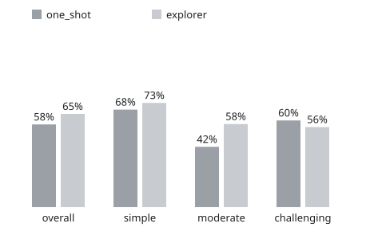

# sql-agent

Ask a SQL database a question in plain language. An agent reads a map of the database, looks up only the tables,
column meanings and values it needs, writes one read-only `SELECT`, runs it, and shows every step it took.

**On 300 BIRD questions it had never seen, it answered 65.0% correctly, against 57.7% for the same model writing
SQL in one shot (+7.3 points, 95% CI [+2.7, +12.0]).** It scores the same on SQLite and PostgreSQL (66.4% vs
65.8% on the same 149 questions) and typically answers in about 6 seconds for about $0.001 per question.



## How it works

```
question ─► map of the database (tables, row counts, joins) ─► gpt-6-luna ──┬─► <sql>…</sql> ─► answer
                                                                ▲          │
                        describe_table(t)   columns, types, keys, meaning   │
                        column_values(t,c,…) how values are really written  ├─ tool calls (≤ 15)
                        run_sql(q)           first 20 rows or the error     │
                                                                └──────────┘
```

- **Context on demand.** The prompt holds only the map. The model calls `describe_table` for column meanings
  (from a catalog file you write, or the database's own comments) and `column_values` to find how a value is
  spelled in the data (`'east Bohemia'`, not `'East Bohemia'`).
- **Any SQLAlchemy database.** `Database(url, catalog, tables)` works on SQLite, PostgreSQL and MySQL; the prompt
  names the dialect; an optional table list limits what the agent can see (enforced for every query on SQLite;
  on server databases it focuses the agent, and real access control is the database user's grants).
- **Read-only by construction.** SQLite: `mode=ro` plus an authorizer that allows only reads (without it,
  `VACUUM INTO` could still write a copy of the database to disk). Server databases: one `SELECT`/`WITH` statement
  only, a read-only transaction, a server-side timeout, and, as the real guarantee, a database user with
  `SELECT`-only grants (the PostgreSQL setup script creates one).
- **Local web UI.** `uv run sqlagent-web` opens a page where you connect a database and watch the agent work: the
  table it reads lights up on a schema graph, the values it finds pop up, the query lights the joins it uses.

## Results

All numbers use BIRD's execution accuracy (the result rows must equal the reference query's rows, ignoring order
and duplicates), model `gpt-6-luna` with `reasoning_effort: "none"`, 10-second query timeout.

### Held-out: 300 questions never used during development

BIRD dev questions not in mini-dev, picked once with a fixed seed (`eval/make_heldout.py`): 150 simple, 107
moderate and all 43 remaining challenging ones. The engine was frozen before the run (commit `a888462`).

| | overall | simple | moderate | challenging (n=43) |
|---|---|---|---|---|
| one-shot (schema in the prompt, no tools) | 57.7% | 68.0% | 42.1% | 60.5% |
| **explorer agent** | **65.0%** | **72.7%** | **57.9%** | 55.8% |

The gain is largest on moderate questions (+15.8 points). On the 43 challenging questions the one-shot baseline is
ahead by 2 questions, which is well inside the noise for a sample that small.

### Same agent, SQLite and PostgreSQL

The BIRD PostgreSQL dump (75 tables) loaded in Docker, a `SELECT`-only role, the same 149 mini-dev questions,
each dialect scored against its own reference SQL.

| | accuracy | median time | p90 time | cost / question |
|---|---|---|---|---|
| SQLite | 66.4% | 5.7 s | 10.9 s | $0.0011 |
| PostgreSQL | 65.8% | 5.8 s | 9.9 s | $0.0011 |

Difference −0.7 points, 95% CI [−6.0, +5.4]: no measurable difference (`uv run python eval/report.py results_v5_sqlite.jsonl results_v5_pg.jsonl --baseline explorer_sqlite`).

### How it got there (development set: BIRD mini-dev, 496 questions, SQLite)

| version | change | accuracy |
|---|---|---|
| one-shot | schema and 3 sample rows in the prompt | 55.6% |
| one-shot, run again | same thing, to measure run-to-run noise | 55.8% |
| + `run_sql` loop | the model may test its query and fix it | 54.8% |
| + forced checking | the model must run the query before answering | 55.2% |
| explorer v2 | map + three tools + column descriptions + XML prompt with examples | 61.9% |
| explorer v3 | step cap 15 with a tool-free final turn, output rules from the failure review | 63.9% |

These rules were tuned on this set, so the held-out table above is the honest measure.

### What did not work, and why

- **A self-correction loop.** Letting the model run and fix its own query changed accuracy by −0.8 points
  (95% CI [−3.2, +1.6]), inside the ±2-point noise floor measured by re-running the baseline. 87% of the wrong
  answers (192 of 220) ran without an error and returned plausible but wrong rows, so there was nothing for the
  loop to notice. What helped was giving the model the context to avoid the mistake (column meanings and real
  value spellings), not a chance to retry.
- **A critic.** A second model call reviewing the answer, three versions. The first two made things worse on a
  60-question development sample (−8.3 and −3.3 points). The third only flags omissions it can quote from the
  question and lets the agent reject the feedback; it helped on the development sample (+2 answers, 0 broken) but
  on the held-out set it fixed 2 answers and broke 5 (65.0% → 64.0%; not significant, p ≈ 0.45). It is off by
  default (`--critic` turns it on).

### The benchmark has errors too

All 189 wrong answers from explorer v2 were reviewed by hand (`eval/gold_fixes.json` and the review notes): 91
were agent mistakes, 49 were ambiguous, and in 49 the reference query itself is wrong, for example a missing
parenthesis around `OR` that drops a filter, counting rows of a join instead of distinct patients, or sorting
ascending for "the highest". With 46 of those references corrected, explorer v3 scores 70.4% and one-shot 61.9%.
The corrections were made only where the agent was wrong, so they favour the agent somewhat; the headline numbers
above use the original references.

### Bugs found by reading the failures

- The model XML-escaped its own SQL inside `<sql>` tags (`&gt;` for `>`): 54 answers failed to parse; 26 of them
  were correct once unescaped.
- psycopg reads a bare `%` in `LIKE '%x%'` as a parameter placeholder; every such query would have failed on PostgreSQL.
- One BIRD description file has an unnamed column holding the value codes for `account.frequency`, so the agent
  never saw them until v5.
- `mode=ro` alone still allowed `VACUUM INTO` and `ATTACH` to create files.

## Run it

```bash
uv sync
# BIRD mini-dev (801 MB): databases, questions, PostgreSQL/MySQL dumps
curl -L -o data/minidev.zip https://bird-bench.oss-cn-beijing.aliyuncs.com/minidev.zip && unzip -q data/minidev.zip -d data/
echo "OPENAI_API_KEY=sk-..." > .env

uv run --env-file .env ask --db financial "How many accounts are in the east Bohemia region?"
uv run --env-file .env sqlagent-web          # http://127.0.0.1:8000

# your own database: a URL, an optional catalog, an optional table list
uv run --env-file .env ask --url "postgresql+psycopg://user:pw@host/db" --catalog catalog.json --tables orders,customers "…"
uv run python -m sqlagent.catalog path/to/database_description > catalog.json   # BIRD CSVs → catalog
```

PostgreSQL with the BIRD dump (Docker): put `BIRD_PG_ADMIN_PASSWORD`, `BIRD_PG_AGENT_PASSWORD` and
`PG_URL=postgresql+psycopg://agent_ro:<agent password>@127.0.0.1:5433/postgres` in `.env`, then
`set -a; . ./.env; set +a; ./scripts/pg_bird.sh`.

Evaluation: `eval/run.py` (resumable; `--questions`, `--sample`, `--db-url`, `--critic`), `eval/report.py`
(accuracy by difficulty, paired-bootstrap CIs, latency, critic effect), `eval/rescore.py` (corrected references),
`eval/make_heldout.py`. The result files behind every table are in the repository root (`results_*.jsonl`).
Tests: `uv run pytest` (PostgreSQL tests run when `PG_URL` is set).

## Limits

- One model (`gpt-6-luna`) and one benchmark (BIRD). The 11 databases are small enough that their maps fit easily
  in a prompt; very large schemas would need a smarter map.
- Latency includes waiting on the API's rate limits; the held-out run had two runs in parallel (median 8.2 s).
- The challenging held-out slice has 43 questions, so its accuracy is uncertain by about ±15 points.
- The single-statement check also rejects a `;` inside a string literal, and the XML unescape could alter a literal
  that really contains `&amp;`; both are conservative and rare.
- MySQL is supported by the same code but was not evaluated. Read-only safety on server databases ultimately rests
  on the database user's grants (on MySQL, `SELECT … INTO OUTFILE` passes the single-statement check and is stopped
  only by the user lacking the FILE privilege).
- The web UI is a local tool: it listens on 127.0.0.1 only, refuses other host names (DNS-rebinding guard) and has
  no login.

## Data

BIRD mini-dev and BIRD dev, CC BY-SA 4.0 — Li et al., "Can LLM Already Serve as A Database Interface? A BIg Bench
for Large-Scale Database Grounded Text-to-SQLs" (NeurIPS 2023), https://bird-bench.github.io/ and
https://github.com/bird-bench/mini_dev.
