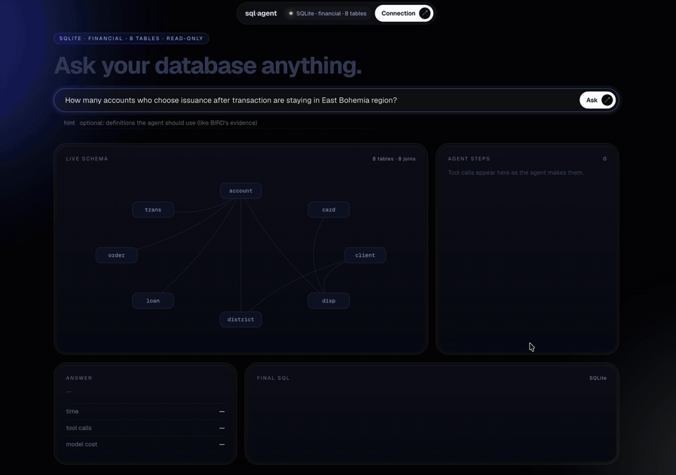

# sql-agent

Ask a SQL database a question in plain language. The agent reads a map of the database. It looks up only the
tables, column meanings and values that it needs. Then it writes one read-only `SELECT`, runs it, and shows every
step.

**On 300 BIRD questions that it had not seen, the agent answered 65.0% correctly. The same model that writes SQL in
one shot answered 57.7% correctly (+7.3 points, 95% CI [+2.7, +12.0]).** The agent gets the same score on SQLite
and PostgreSQL (66.4% and 65.8% on the same 149 questions). A typical answer takes about 6 seconds and costs about
$0.001.




Two recorded runs, step by step: https://berkaykoklu.com/projects/sql-agent

## How it works

```
question ─► map of the database (tables, row counts, joins) ─► gpt-6-luna ──┬─► <sql>…</sql> ─► answer
                                                                ▲          │
                        describe_table(t)   columns, types, keys, meaning   │
                        column_values(t,c,…) how values are really written  ├─ tool calls (≤ 15)
                        run_sql(q)           first 20 rows or the error     │
                                                                └──────────┘
```

- **The agent gets context when it needs it.** The prompt holds only the map.
  - `describe_table` gives the column meanings. They come from a catalog file that you write, or from the
    database's own column comments.
  - `column_values` shows how a value is written in the data. For example, the data has `'east Bohemia'`, not
    `'East Bohemia'`.
- **It works on any SQLAlchemy database.** `Database(url, catalog, tables)` works on SQLite, PostgreSQL and MySQL.
  The prompt names the SQL dialect.
  - An optional table list limits what the agent can see.
  - On SQLite, the list applies to every query.
  - On server databases, the list only focuses the agent. Use the database user's grants for real access control.
- **It is read-only by design.**
  - SQLite: the file opens with `mode=ro`. An authorizer allows only reads. Without the authorizer, `VACUUM INTO`
    could write a copy of the database to disk.
  - Server databases: only one `SELECT` or `WITH` statement is allowed. It runs in a read-only transaction with a
    server-side timeout.
  - The real guarantee on a server database is a user with `SELECT`-only grants. The PostgreSQL setup script
    creates one.
- **It has a local web UI.** `uv run sqlagent-web` opens a page. Connect a database there and watch the agent work.
  - The table that the agent reads lights up on a schema graph.
  - The values that it finds appear on the graph.
  - The final query lights up the joins that it uses.

## Results

All numbers use BIRD's execution accuracy. The result rows must be equal to the rows of the reference query.
Row order and duplicate rows do not count. The model is `gpt-6-luna` with `reasoning_effort: "none"`. The query
timeout is 10 seconds.

### Held-out set: 300 questions that development did not use

The held-out set contains BIRD dev questions that are not in mini-dev. `eval/make_heldout.py` picked them once
with a fixed seed: 150 simple, 107 moderate and all 43 remaining challenging questions. The code was frozen before
the run (commit `a888462`).

| | overall | simple | moderate | challenging (n=43) |
|---|---|---|---|---|
| one-shot (schema in the prompt, no tools) | 57.7% | 68.0% | 42.1% | 60.5% |
| **explorer agent** | **65.0%** | **72.7%** | **57.9%** | 55.8% |

The largest gain is on moderate questions (+15.8 points). On the 43 challenging questions, one-shot is ahead by 2
questions. For a sample this small, that difference is inside the noise.

### Same agent on SQLite and PostgreSQL

Setup:
- The BIRD PostgreSQL dump (75 tables) runs in Docker.
- The agent connects as a `SELECT`-only user.
- Both databases get the same 149 mini-dev questions.
- Each dialect is scored against its own reference queries.

| | accuracy | median time | p90 time | cost / question |
|---|---|---|---|---|
| SQLite | 66.4% | 5.7 s | 10.9 s | $0.0011 |
| PostgreSQL | 65.8% | 5.8 s | 9.9 s | $0.0011 |

The difference is −0.7 points, 95% CI [−6.0, +5.4]. There is no measurable difference. To get these numbers again,
run `uv run python eval/report.py results_v5_sqlite.jsonl results_v5_pg.jsonl --baseline explorer_sqlite`.

### Development steps (BIRD mini-dev, 496 questions, SQLite)

| version | change | accuracy |
|---|---|---|
| one-shot | schema and 3 sample rows in the prompt | 55.6% |
| one-shot, run again | the same, to measure the noise between runs | 55.8% |
| + `run_sql` loop | the model can test its query and fix it | 54.8% |
| + forced check | the model must run the query before it answers | 55.2% |
| explorer v2 | map, three tools, column descriptions, XML prompt with examples | 61.9% |
| explorer v3 | step cap of 15 with a final turn without tools, output rules from the failure review | 63.9% |

These rules were tuned on this set. The held-out table above is therefore the honest measure.

### What did not work, and why

- **A self-correction loop.** The model could run its own query and fix it. Accuracy changed by −0.8 points (95% CI
  [−3.2, +1.6]). This is inside the noise floor of ±2 points, which a second baseline run measured.
  - 87% of the wrong answers (192 of 220) ran without an error and returned wrong rows that looked correct. The
    loop had nothing to notice.
  - Context helped instead: column meanings and the real spelling of values. The model avoided the mistake, so it
    did not need a second try.
- **A critic.** A second model call reviews the answer. There were three versions.
  - The first two versions made results worse on a development sample of 60 questions (−8.3 and −3.3 points).
  - The third version flags only omissions that it can quote from the question. The agent can reject its
    feedback. On the development sample it fixed 2 answers and broke 0.
  - On the held-out set, it fixed 2 answers and broke 5 (65.0% → 64.0%, not significant, p ≈ 0.45).
  - The critic is off by default. `--critic` turns it on.

### The benchmark has errors too

We reviewed all 189 wrong answers of explorer v2 by hand. The results are in `eval/gold_fixes.json` and the review
notes.
- 91 were agent mistakes.
- 49 were ambiguous questions.
- In 49, the reference query itself is wrong. Examples:
  - A missing parenthesis around `OR` drops a filter.
  - The query counts the rows of a join, not distinct patients.
  - The query sorts in ascending order for "the highest".

With 46 of those reference queries corrected, explorer v3 gets 70.4% and one-shot gets 61.9%. We corrected
references only where the agent was wrong, so the corrections favour the agent. The main numbers above use the
original reference queries.

### Bugs found by reading the failures

- The model XML-escaped its own SQL inside `<sql>` tags (`&gt;` for `>`). 54 answers could not be parsed. After
  the fix, 26 of them were correct.
- psycopg reads a bare `%` in `LIKE '%x%'` as a parameter placeholder. On PostgreSQL, every such query would fail.
- One BIRD description file has a column without a name. That column holds the value codes for
  `account.frequency`. The agent did not see the codes until v5.
- `mode=ro` alone still let `VACUUM INTO` and `ATTACH` create files.

## Run it

```bash
uv sync
# BIRD mini-dev (801 MB): databases, questions, PostgreSQL/MySQL dumps
curl -L -o data/minidev.zip https://bird-bench.oss-cn-beijing.aliyuncs.com/minidev.zip && unzip -q data/minidev.zip -d data/
echo "OPENAI_API_KEY=sk-..." > .env

uv run --env-file .env ask --db financial "How many accounts are in the east Bohemia region?"
uv run --env-file .env sqlagent-web          # http://127.0.0.1:8000

# your own database: a URL, an optional catalog, an optional table list
uv run --env-file .env ask --url "postgresql+psycopg://user:pw@host/db" --catalog catalog.json --tables orders,customers "…"
uv run python -m sqlagent.catalog path/to/database_description > catalog.json   # BIRD CSVs → catalog
```

To run PostgreSQL with the BIRD dump in Docker:
1. Put `BIRD_PG_ADMIN_PASSWORD` and `BIRD_PG_AGENT_PASSWORD` in `.env`.
2. Put `PG_URL=postgresql+psycopg://agent_ro:<agent password>@127.0.0.1:5433/postgres` in `.env`.
3. Run `set -a; . ./.env; set +a; ./scripts/pg_bird.sh`.

Evaluation:
- `eval/run.py` runs the questions. You can stop and resume it. Flags: `--questions`, `--sample`, `--db-url`,
  `--critic`.
- `eval/report.py` gives accuracy by difficulty, paired-bootstrap CIs, latency and the effect of the critic.
- `eval/rescore.py` scores again with the corrected reference queries.
- `eval/make_heldout.py` picks the held-out set.
- The result files for every table are in the repository root (`results_*.jsonl`).

Tests: run `uv run pytest`. The PostgreSQL tests run only when `PG_URL` is set.

## Limits

- The tests used one model (`gpt-6-luna`) and one benchmark (BIRD).
- The maps of the 11 databases fit easily in a prompt. A very large schema needs a better map.
- The latency includes waits for the API's rate limits. The held-out set ran with two runs in parallel (median
  8.2 s).
- The challenging part of the held-out set has only 43 questions. Its accuracy can be wrong by about ±15 points.
- Two checks are stricter than necessary. Both cases are rare.
  - The single-statement check also rejects a `;` inside a string literal.
  - The XML unescape can change a literal that really contains `&amp;`.
- The code supports MySQL, but we did not evaluate it.
- On server databases, read-only safety depends on the grants of the database user. For example, on MySQL,
  `SELECT … INTO OUTFILE` passes the single-statement check. Only a user without the FILE privilege stops it.
- The web UI is a local tool without a login. It listens only on 127.0.0.1. It refuses other host names, which
  stops DNS rebinding.

## Data

BIRD mini-dev and BIRD dev, CC BY-SA 4.0. Li et al., "Can LLM Already Serve as A Database Interface? A BIg Bench
for Large-Scale Database Grounded Text-to-SQLs" (NeurIPS 2023). https://bird-bench.github.io/ and
https://github.com/bird-bench/mini_dev.
